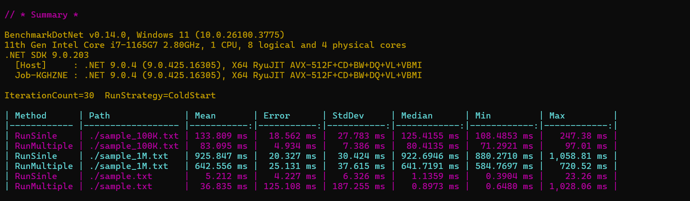

# Bajet Code Challenge

A high-performance file processing system designed to efficiently process large files in parallel.

## Overview

This project implements a parallel processor that can efficiently read and process large files without loading the entire file into memory. It utilizes a producer-consumer pattern with multiple threads to maximize performance on multi-core systems.

## Features

- **Parallel Processing**: Utilizes all available CPU cores for maximum performance
- **Memory Efficient**: Processes large files without loading them entirely into memory
- **Scalable**: Performance scales with both file size and number of processors

## Architecture

The system is built using a producer-consumer pattern with the following components:

### TransactionProcessor

The main class that orchestrates the parallel processing of transaction files:

- **Producers**: Multiple threads that read different chunks of the file in parallel
- **Consumers**: Multiple threads that process the data from a shared queue
- **Queue**: A thread-safe collection that connects producers and consumers

### FileReader

A utility class that divides the input file into chunks for parallel processing:

- **GetFileChunks**: Divides the file into chunks based on file size and processor count


### ProcessorResult

Contains the final processing results:

- **TotalCount**: Total number of transactions processed
- **TotalSum**: Total sum of all transaction amounts
- **Duplicates**: Dictionary of duplicate transactions with their counts

## Usage

### Basic Usage

```csharp
var processor = new TransactionProcessor();
var result = await processor.Run("path/to/file.txt");
```

### Single Producer Mode

For smaller files or when parallel processing isn't needed:

```csharp
var processor = new TransactionProcessor();
var result = await processor.RunWihSingleProducer("path/to/transaction/file.txt");
```

## Input File Format

The system expects tab-delimited transaction files with the following format:

```
source_account	amount	ssn
12345467890123	1000010000000	1718899553
12345467890123	1000000000000	1718899553
...
```

## Performance Considerations

- The system automatically scales to use all available CPU cores
- For very large files, the parallel processing mode is recommended
- For smaller files, the single producer mode may be more efficient

## Requirements

- .NET 9.0 or later
- Sufficient disk space for the transaction files
- Multi-core processor recommended for optimal performance

## License

This project is licensed under the MIT License - see the [LICENSE](LICENSE) file for details.

## Contact

For questions or feedback, please reach out to [abowfzl@gmail.com](mailto:abowfzl@gmail.com).
